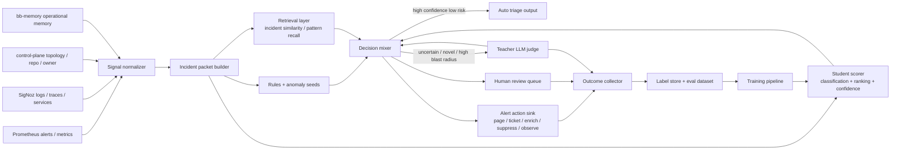
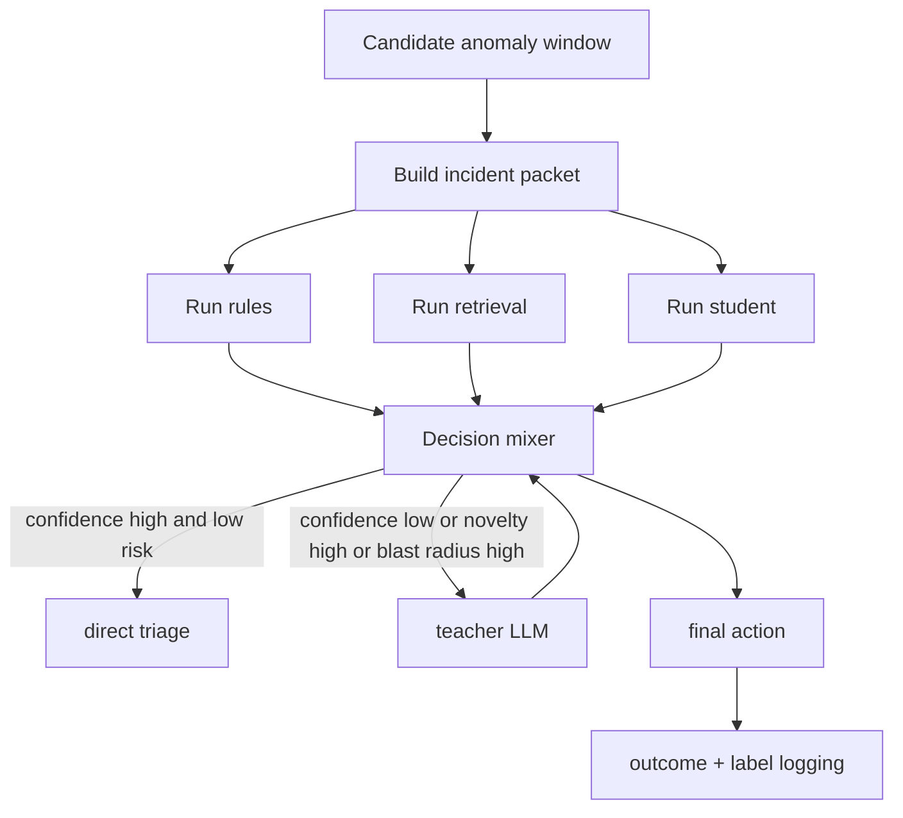
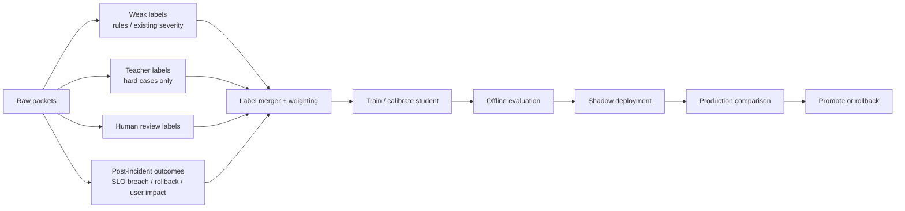

# Alert Intelligence Architecture

- Status: draft-ssot
- Scope: production alert triage / severity ranking / escalation routing
- Primary objective: 在预算受限前提下，提高“规则未覆盖但真实严重”的事件召回率
- Current inputs: `Prometheus`, `SigNoz`, `control-plane`, `bb-memory`
- Non-goal: 直接让大模型全量扫所有原始日志；直接让 AI 自动发布线上修复

---

## 1. Problem Statement

当前监控体系主要依赖规则引擎：

- 优点：高精度、可控、便宜、适合已知问题
- 缺点：覆盖有限、泛化弱、对未知严重事件 recall 低、规则维护成本持续上升

目标不是替换全部规则，而是构建一个 **cost-aware layered triage system**：

- 规则保留为高精度 hard signal
- 学习系统负责泛化与排序
- 大模型只处理高价值难例
- 人类反馈与真实 outcome 形成持续学习闭环

---

## 2. Bitter Lesson Ground Rules

本设计遵循 `/home/peng/dt-git/github/pi-sdk/theBitterLessons.md` 的核心约束。

### 2.1 Long-term bias

优先投入到以下可扩展资产，而不是 endless heuristics：

- 统一样本表示：`incident packet`
- 检索：相似事件 / 相似日志簇 / 相似 trace path 搜索
- 学习：student ranking/classification
- 反馈：teacher judgement + human outcome + production result
- 计算分层：cheap bulk triage + expensive sparse reasoning

### 2.2 Explicit anti-patterns

避免把系统做成：

- 更复杂的人工规则引擎
- 更长的 prompt 规则
- 全量原始日志交给大模型
- 只看 teacher 标签、不看真实 outcome
- 只训练已被规则命中的样本

### 2.3 Architectural thesis

长期正确方向不是“把人总结的规则塞给模型”，而是：

> 用统一事件表示 + 搜索 + 学习 + 反馈，让系统随着数据量、算力和时间一起变强。

---

## 3. System Goals

## 3.1 Primary goals

1. 提升 severe incident recall，特别是规则未覆盖区域。
2. 在固定预算下控制 teacher LLM 调用量。
3. 降低人工 triage 负担，而不是制造新噪音。
4. 保持可审计、可解释、可灰度上线。
5. 把 `service -> topology -> owner -> repo` 关系显式纳入决策。

## 3.2 Secondary goals

- 支持新服务快速接入
- 支持 shadow mode 与 A/B 对比
- 支持回放历史窗口做离线评测
- 支持后续升级到本地小 LLM，但不依赖它作为 MVP 前提

## 3.3 Non-goals

- 不在 v1 追求 root cause 全自动确定
- 不在 v1 追求自动修复闭环
- 不让 bb-memory 充当全量训练样本仓
- 不让规则完全退出系统

---

## 4. Canonical Decision Unit: Incident Packet

系统的标准学习/检索对象不是单条 log line，而是 `incident packet`。

### 4.1 Definition

`incident packet` = 某个时间窗内、围绕某个候选异常对象压缩得到的结构化证据包。

### 4.2 Why this unit

相比原始日志洪流，`incident packet`：

- 更适合做分类、排序、检索、蒸馏
- 更容易跨 service 泛化
- 更容易与 topology、owner、history、outcome 拼接
- 更容易控制 teacher token 成本

### 4.3 Required fields

```json
{
  "packet_id": "ipk_2026_04_16_001",
  "window": {"start": "...", "end": "...", "size": "5m"},
  "environment": "prod",
  "service": "checkout",
  "entity_type": "service_operation",
  "entity_key": "checkout:POST /api/pay",
  "metrics": {
    "error_rate": 0.21,
    "error_rate_baseline": 0.02,
    "p95_ms": 2400,
    "p95_baseline_ms": 410,
    "qps": 122,
    "qps_baseline": 118
  },
  "logs": {
    "top_templates": [
      {"template": "db timeout on order lookup", "count": 182, "novelty": 0.91},
      {"template": "payment upstream 502", "count": 53, "novelty": 0.73}
    ],
    "severity_mix": {"ERROR": 182, "WARN": 61}
  },
  "traces": {
    "top_error_operation": "POST /api/pay",
    "error_span_ratio": 0.34,
    "p95_trace_delta": 2.9
  },
  "topology": {
    "tier": "tier1",
    "upstream_count": 6,
    "downstream_count": 12,
    "blast_radius_score": 0.88,
    "owner": "payments-oncall",
    "repos": ["checkout-service", "payment-gateway-client"]
  },
  "history": {
    "recent_deploy": true,
    "similar_incidents": ["INC-1422", "INC-1198"]
  },
  "rules": {
    "fired": ["high_error_rate"],
    "scores": {"high_error_rate": 0.98}
  }
}
```

---

## 5. High-Level Architecture



---

## 6. Module Responsibilities

| Module | Responsibility | Inputs | Outputs | Notes |
|---|---|---|---|---|
| Signal normalizer | 统一多源时间窗与字段语义 | Prometheus, SigNoz, control-plane, bb-memory | normalized features | 先做标准化，再做学习 |
| Incident packet builder | 生成标准学习单元 | normalized features | `incident packet` | SSOT contract |
| Rules + anomaly seeds | 高精度已知问题 + 异常起点 | packet | hard signals / seed signals | 不再独占判决 |
| Retrieval layer | 搜索相似历史事件和模式 | packet | similarity features + references | 属于 Bitter Lesson 的 `search` |
| Student scorer | bulk triage / ranking / confidence | packet + features | severity score / novelty / confidence | 首选 cheap 模型 |
| Decision mixer | 融合规则、检索、student、teacher | all upstream signals | final decision candidate | 统一决策面 |
| Teacher LLM judge | 处理难例、冲突、未知模式 | compact packet | rubric judgement | 稀缺仲裁器，不做全量 |
| Human review queue | 处理高风险最终样本 | decision candidate | explicit resolution | 人类在环 gate |
| Outcome collector | 汇总真实后验结果 | actions, incident outcomes | labels | 训练 gold source |
| Training pipeline | 更新 student / threshold / calibration | labels + packets | new model | 支持 shadow rollout |

---

## 7. Data Sources and Contracts

## 7.1 Prometheus contract

Prometheus 负责：

- 异常发现起点
- 指标基线/偏移量
- SLO/SLA breach 证据
- 时间窗聚合特征

推荐抽取的最小特征：

- `error_rate`, `error_rate_delta`, `error_rate_zscore`
- `p95_ms`, `p95_delta`, `p99_delta`
- `qps_delta`
- `cpu`, `memory`, `saturation`
- alert firing duration
- 同 service 多指标联动异常数

## 7.2 SigNoz contract

SigNoz 负责：

- 错误日志模板聚类与 topN
- trace error path / slow operation
- service / operation 级异常证据
- 具体 event body 的摘要样本

推荐抽取的最小特征：

- top error templates + count
- template novelty score
- operation error ratio
- top slow operations
- trace error span ratio
- distinct error signatures count

## 7.3 control-plane contract

control-plane 负责 routing / topology / impact truth：

- service criticality / tier
- owner / repo mapping
- upstream/downstream degree
- blast radius hints
- hotspot repo / dependency path

其输出应尽量进入特征，而不是只在人工排查时使用。

## 7.4 bb-memory contract

bb-memory 负责 durable operational memory，不负责全量训练语料：

适合存：

- 已验证的高危模式摘要
- owner routing 经验
- 常见误报/高危提示
- 某类问题的验证命令与排查套路
- 重要历史 incident 摘要与 closeout 结论

不适合存：

- 海量原始日志
- 高频时间窗样本全文
- 全量训练数据

建议配套一个专门的 `incident store / feature store / vector index` 承载训练规模样本；bb-memory 保持高价值摘要记忆。

---

## 8. Student / Teacher Split

## 8.1 Student responsibilities

student 负责：

- 大规模低成本打分
- 严重性排序
- 不确定度估计
- teacher 升级判定

### Recommended student outputs

```json
{
  "severity_score": 0.83,
  "novelty_score": 0.74,
  "confidence": 0.62,
  "route_target": "page_owner",
  "needs_teacher": true,
  "reason_codes": ["new_log_pattern", "tier1_service", "multi_signal_shift"]
}
```

## 8.2 Student model strategy

MVP 不建议直接从“小 LLM”起步。优先顺序：

1. structured features + `GBDT` / `Logistic Regression`
2. embedding similarity + ranker
3. 小型 encoder classifier
4. 证明 ROI 后，再引入本地小 LLM

理由：

- 便宜
- 稳定
- 易校准
- 易回放评测
- 更适合 ranking/classification 任务本质

## 8.3 Teacher responsibilities

teacher 只处理：

- 高新颖度样本
- 高 blast radius 样本
- student 低置信样本
- 规则与 student 冲突样本
- 需要跨信号综合解释的样本

teacher 输出必须结构化，而不是 free-form prose。

### Teacher rubric contract

```json
{
  "severity": 4,
  "customer_impact": 3,
  "scope": 2,
  "novelty": 4,
  "urgency": 4,
  "confidence": 0.72,
  "recommended_action": "page_owner",
  "evidence": [
    "5m error rate increased 6x",
    "new unseen timeout template on tier1 service",
    "trace errors concentrated on POST /api/pay"
  ]
}
```

---

## 9. Retrieval Design

检索层是本架构里最符合 Bitter Lesson `search` 精神的部分。

## 9.1 Retrieval objects

至少建立三类可检索对象：

1. `incident packet embeddings`
2. `log template clusters`
3. `resolved incident summaries`

## 9.2 Retrieval outputs

返回：

- top-k similar incidents
- 相似事件最终严重性 / action / resolution
- 当前 packet 与历史模式的距离
- “已知误报”或“已知高危模式”提示

## 9.3 Why retrieval first

很多所谓“未知严重事件”并非真正首次发生，而是：

- 文案变了
- 服务名变了
- operation 变了
- 依赖位置变了

检索常比复杂推理更稳，也更省 token。

---

## 10. Online Decision Flow



### 10.1 Decision mixer duties

decision mixer 统一处理：

- rule precision override
- student ranking score
- retrieval prior
- topology criticality
- teacher rubric
- budget gating

### 10.2 Example action set

- `suppress`
- `observe`
- `create_ticket`
- `page_owner`
- `page_owner_and_escalate`
- `send_to_human_review`

---

## 11. Training Flow



## 11.1 Label hierarchy

标签源按可靠性分层：

| Label source | Typical reliability | Use |
|---|---:|---|
| Human confirmed severe/non-severe | highest | gold labels |
| Production outcome (`incident`, rollback, customer impact) | very high | primary supervision |
| Teacher rubric | medium-high | distillation / hard-case supervision |
| Rule labels | medium | weak labels |
| Existing alert severity metadata | medium-low | bootstrap only |

## 11.2 Weighting suggestion

- human outcome: `1.0`
- production incident outcome: `0.9`
- teacher rubric: `0.6 - 0.8`
- rule labels: `0.5 - 0.7`
- inherited static severity: `0.3 - 0.5`

---

## 12. Evaluation Flow

## 12.1 Offline evaluation

核心不是追求 overall accuracy，而是看：

- severe recall
- false negative cost
- precision at top-K triage queue
- teacher escalation rate
- calibration error
- novel severe catch rate

## 12.2 Shadow evaluation

新系统先 shadow，不抢生产权：

- 当前规则系统照常运行
- 新系统并行输出 severity/rank/action
- 对比 miss / catch / ordering / cost
- 周级复盘 disagreement case

## 12.3 Online evaluation

上线后看：

- 人工 triage 时长是否下降
- 漏报 severe 是否下降
- teacher token 成本是否受控
- 重要服务 recall 是否提升

---

## 13. Active Learning and Exploration Budget

这是系统是否持续变聪明的关键设计。

## 13.1 Why required

如果 teacher 只看 student 已经挑出来的样本，系统会固化盲区。

## 13.2 Required lanes

保留三条样本升级通道：

1. `uncertainty lane`：低置信样本
2. `risk lane`：高 criticality / 高 blast radius 样本
3. `exploration lane`：低分样本中的随机抽检

## 13.3 Suggested quotas

- uncertainty lane: `60%`
- risk lane: `30%`
- exploration lane: `10%`

比例可调，但 exploration 不应为 `0`。

---

## 14. Cost and Budget Controls

## 14.1 Cost hierarchy

从低到高：

1. rules / numeric features
2. retrieval + embeddings
3. student classifier/ranker
4. teacher LLM
5. human review

## 14.2 Budget gates

teacher 触发必须受预算约束：

- 每小时 token budget
- 每服务 teacher quota
- 高 tier 服务优先级更高
- 夜间/高峰期动态调整阈值

## 14.3 Compact packet for teacher

teacher 输入必须是 compact packet，而不是原始全量 logs：

- top metrics deltas
- top log templates
- top trace anomalies
- topology summary
- retrieved similar incidents
- current student/rule disagreement

---

## 15. Governance and Safety

## 15.1 Human-in-the-loop boundaries

以下场景默认不允许自动 suppress 或自动低优先处理：

- tier1 / revenue-critical service
- auth / billing / order / payment / settlement related domains
- 新模式且置信不足
- 多源同时异常但原因不清

## 15.2 Auditability

每个最终判决应保留：

- packet snapshot
- feature summary
- rule hits
- retrieval refs
- student output
- teacher rubric
- final action
- 后验 outcome

## 15.3 Failure containment

任何新 student 版本都必须支持：

- shadow compare
- quick rollback
- per-service canary
- versioned threshold config

---

## 16. Recommended Storage Split

| Store | What to keep | What not to keep |
|---|---|---|
| Feature store / incident store | packet features, labels, eval datasets | human prose memory |
| Vector index | packet/log/template embeddings | authoritative labels |
| bb-memory | durable operational summaries, known patterns, owner heuristics | full raw logs, massive training corpus |
| control-plane | topology / repo / owner / impact truth | time-series telemetry |
| SigNoz / Prometheus | raw and aggregated observability truth | long-term model labels without extraction |

---

## 17. Rollout Strategy

### Phase A — Foundation

- 建立 `incident packet` contract
- 建立历史 packet 回放能力
- 建立 label store

### Phase B — Baseline student

- 规则 + 特征 + 检索 + GBDT/LR
- 不先上小 LLM
- 开始 shadow compare

### Phase C — Teacher distillation

- 只让 teacher 看难例
- 累积 hard-case dataset
- 做 calibration 与 threshold tuning

### Phase D — Local small model upgrade

仅在满足以下条件时引入本地小 LLM：

- 已证明结构化 baseline 的 recall ceiling 明显到顶
- teacher rubric 数据足够多
- 已有 compact packet 格式稳定
- 有明确收益假设：本地小 LLM 比 baseline 在 hard-case recall 上显著提升

---

## 18. Architecture Decision Summary

### Chosen approach

采用：

- `rules + anomaly seeds`
- `incident packet` 作为 canonical unit
- `retrieval + student + teacher + human outcome` layered system
- `budget-gated teacher usage`
- `shadow-first rollout`

### Explicit rejections

拒绝作为主路线：

- 单纯继续扩规则
- 全量日志送大模型分析
- 直接从小 LLM 做第一层 bulk triage
- 只基于 prompt engineering 替代数据与评测建设

### Why

这是当前条件下最符合 Bitter Lesson、也最具长期复利的路线：

- 更依赖可扩展的搜索和学习
- 更少依赖手工领域启发式
- 能随数据量、模型能力和算力持续变强

---

## 19. Exit Criteria for Architecture Readiness

当以下条件成立，可认为架构准备进入工程化实现：

- `incident packet` schema 冻结到 v1
- 输入源 contract 明确：Prometheus / SigNoz / control-plane / bb-memory
- baseline eval metrics 明确
- teacher budget policy 明确
- shadow compare plan 明确
- label hierarchy 与 weighting policy 明确
- bb-memory 与 feature store 的职责边界明确
