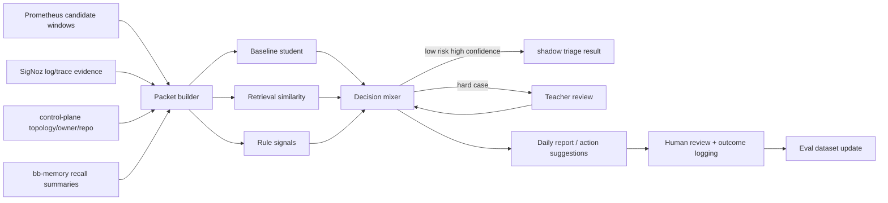

# Alert Intelligence MVP Plan

- Status: executable draft
- Goal: 用当前 `Prometheus + SigNoz + control-plane + bb-memory` 条件，做出一个可 shadow 运行的最小闭环
- Principle: 先做 `incident packet + baseline student + teacher hard-case review + evaluation loop`，不先追求本地小 LLM
- Expected outcome: 在不替换现有规则引擎的前提下，发现并排序规则漏掉的严重候选事件

---

## 1. MVP Scope

## 1.1 In scope

1. 从现有监控流中抽取候选异常窗口
2. 生成 `incident packet`
3. 接入 `SigNoz`、`Prometheus`、`control-plane`、`bb-memory`
4. 做一个 baseline student scorer
5. 建立 teacher 复核与标签回流
6. shadow 跑分、对比现有规则系统
7. 输出明确评测指标与下一阶段升级条件

## 1.2 Out of scope

- 不在 MVP 上本地小 LLM 训练/部署
- 不做自动修复
- 不做自动发布
- 不做全量根因分析
- 不做复杂 UI；先接受 CLI / batch / markdown/json report

---

## 2. MVP Deliverables

交付物至少包括：

1. `incident packet` v1 schema
2. packet builder
3. baseline feature extractor
4. baseline student model
5. teacher review payload format
6. label store schema
7. shadow evaluation report template
8. 每日/每小时 triage output artifact

建议工程目录：

```text
fixit/
  docs/
    architecture/
    mvp/
  schemas/
    incident-packet.v1.json
    teacher-judgement.v1.json
    triage-decision.v1.json
  configs/
    services.yaml
    thresholds.yaml
    teacher-budget.yaml
  scripts/
    build_packets.py
    run_student.py
    run_teacher_review.py
    evaluate_shadow.py
  data/
    samples/
    eval/
    reports/
```

当前 repo 还空，可以按上面结构逐步建。

---

## 3. MVP Design Decisions

## 3.1 Decision A — Student 不从小 LLM 起步

MVP student 选择：

- structured numeric features
- template / incident embedding features
- `GBDT` 或 `Logistic Regression` 或轻量 ranker

原因：

- 更快落地
- 更容易验证方向对不对
- 更便宜
- 更容易做 shadow replay

本地小 LLM 放到 Phase 2；前提是 baseline ceiling 已明确。

## 3.2 Decision B — Teacher 只看 hard cases

teacher 触发条件：

- student `confidence < threshold`
- `novelty_score` 高
- `blast_radius_score` 高
- 规则与 student 冲突
- tier1 服务样本

## 3.3 Decision C — bb-memory 不做训练主仓

bb-memory 在 MVP 中只做：

- 相似历史事件摘要 recall
- owner/操作经验 recall
- 常见误报/高危模式 recall

训练主数据放本地 `feature store / jsonl dataset / vector index`。

---

## 4. MVP End-to-End Flow



---

## 5. Concrete Integration Plan by Source

## 5.1 Prometheus integration

MVP 角色：候选异常窗口发现器。

### Minimum extraction

对每个服务/operation 每 `5m` 窗口抽取：

- `error_rate`
- `error_rate_delta`
- `p95_delta`
- `p99_delta`
- `qps_delta`
- 当前 firing alerts 列表
- firing 持续时间

### Candidate generation rule

任一条件成立即生成 `candidate window`：

- 已有告警触发
- error_rate / latency / saturation 超动态阈值
- 同一服务多个信号同时跳变

这里允许先保守，宁可召回多一点；后面 student 再排序。

## 5.2 SigNoz integration

MVP 角色：把 candidate window 压缩成可学习证据。

### For each candidate window

至少补充：

- top error log templates
- top operations with errors
- trace error ratio
- top slow operations
- 关键错误正文摘要样本 3~5 条

### Packetization rule

日志不要全量塞进去；只保留：

- top-K 模板
- count
- novelty
- 代表样本

## 5.3 control-plane integration

MVP 角色：提供 routing / criticality / impact 特征。

### Minimum fields

- service tier / criticality
- owner
- repo candidates
- upstream/downstream counts
- hotspot / blast radius hints

### Why required in MVP

因为“同样的异常强度”在不同业务关键度服务上代表不同严重性。

## 5.4 bb-memory integration

MVP 角色：高价值经验 recall。

### Suggested recall topics

- `service + error pattern + similar incident`
- `known false positive patterns`
- `owner routing conventions`
- `recent related incidents`

### Recall output usage

只把 recall 摘要作为 packet 的补充字段，不要直接当标签真相。

---

## 6. Required Schemas

## 6.1 `incident-packet.v1.json`

最小字段：

```json
{
  "packet_id": "string",
  "ts_start": "string",
  "ts_end": "string",
  "env": "prod",
  "service": "string",
  "operation": "string|null",
  "metrics": {
    "error_rate": 0.0,
    "error_rate_delta": 0.0,
    "p95_delta": 0.0,
    "qps_delta": 0.0
  },
  "logs": {
    "top_templates": [],
    "severity_mix": {}
  },
  "traces": {
    "top_error_operation": "string|null",
    "error_span_ratio": 0.0
  },
  "topology": {
    "tier": "string|null",
    "owner": "string|null",
    "repos": [],
    "blast_radius_score": 0.0
  },
  "rules": {
    "fired": [],
    "scores": {}
  },
  "memory": {
    "similar_summaries": []
  }
}
```

## 6.2 `teacher-judgement.v1.json`

```json
{
  "packet_id": "string",
  "severity": 1,
  "customer_impact": 1,
  "scope": 1,
  "novelty": 1,
  "urgency": 1,
  "confidence": 0.0,
  "recommended_action": "observe",
  "evidence": []
}
```

## 6.3 `triage-decision.v1.json`

```json
{
  "packet_id": "string",
  "student_score": 0.0,
  "student_confidence": 0.0,
  "novelty_score": 0.0,
  "rule_signals": [],
  "retrieval_refs": [],
  "teacher_used": false,
  "final_action": "observe",
  "final_priority": "P3",
  "explanations": []
}
```

---

## 7. Step-by-Step Implementation Plan

## Step 0 — Freeze packet contract

### Output

- `schemas/incident-packet.v1.json`
- `schemas/teacher-judgement.v1.json`
- `schemas/triage-decision.v1.json`

### Exit gate

- 所有上游字段都有归属
- 不需要每次改 prompt 才能补字段
- 字段足够支持 student / teacher / eval

## Step 1 — Build candidate window generator

### Implementation

从 Prometheus 或当前规则系统的事件流中，产出候选窗口：

- key: `service + operation(optional) + 5m window`
- source: alert firing + metric spike detector

### Output

`data/samples/candidate-windows.jsonl`

### Exit gate

- 能稳定产出过去 7~14 天的回放样本
- 候选窗口数量可控

## Step 2 — Build packet builder

### Implementation

对每个 candidate window：

1. 查 SigNoz logs/traces 摘要
2. 查 control-plane service/topology/owner/repo
3. 做 focused bb-memory recall
4. 拼成 `incident packet`

### Output

`data/samples/incident-packets.jsonl`

### Exit gate

- packet build 成功率高
- 同类异常 packet 结构一致
- 单 packet 不过大，适合 teacher 输入

## Step 3 — Add retrieval baseline

### Implementation

最小做法：

- 用 packet 文本摘要或 embedding 做 top-k 相似 incident 检索
- 先从历史 markdown/jsonl 中检索都行

### Output

- `retrieval_refs`
- `similarity_score`
- `known_pattern_hint`

### Exit gate

- 至少能在历史集中找到相似事件
- retrieval 对 triage 有可解释贡献

## Step 4 — Train baseline student

### Feature set

- metric deltas
- rules fired count
- template novelty
- log error count
- trace error ratio
- tier / blast radius
- retrieval similarity to severe incidents
- recent deploy flag

### Labels

初期可混合：

- 规则已有 severity
- teacher judgement
- 人工 review 结果
- 真实 incident outcome

### Model options

- first choice: `LightGBM` / `XGBoost`
- second choice: `Logistic Regression`
- ranking task 可选 `pairwise ranker`

### Output

- `model.pkl`
- `thresholds.yaml`
- `feature_importance.md`

### Exit gate

- severe recall 优于纯规则 baseline
- 结果可校准、可解释

## Step 5 — Add teacher lane

### Teacher input

仅发送 compact packet：

- metrics summary
- top log templates
- trace summary
- topology summary
- retrieval top refs
- student/rule disagreement

### Teacher trigger policy

- `confidence < 0.65`
- `novelty_score > 0.8`
- `blast_radius_score > 0.8`
- tier1 service with any anomaly

### Output

`data/samples/teacher-judgements.jsonl`

### Exit gate

- teacher 用量受预算控制
- teacher judgement 对 hard-case 排序有明显增益

## Step 6 — Build shadow daily report

### Report content

- top severe candidates by new system
- rule missed but model ranked high
- teacher reviewed hard cases
- disagreement with existing rule severity
- owner / repo routing hints

### Output files

- `data/reports/daily-shadow-report.md`
- `data/reports/daily-shadow-report.json`

### Exit gate

- 人工可以据此复核价值
- shadow 报告能支撑周复盘

## Step 7 — Build eval loop

### Offline metrics

- severe recall
- top-K precision
- teacher escalation rate
- missed severe count
- calibration buckets

### Online/shadow metrics

- 新系统发现的规则漏报 severe 数
- 人工 triage 时间变化
- teacher 每日成本

### Exit gate

- 可连续每周产出同口径评测结果

---

## 8. MVP Label Strategy

## 8.1 Label sources

| Label | Source | Role |
|---|---|---|
| severe / non-severe confirmed | 人工复核 | gold |
| incident happened | 真实后验 | gold-ish |
| teacher rubric | LLM hard-case review | soft label |
| rule severity | 现有系统 | weak label |

## 8.2 First workable definition of `severe`

建议定义成满足任一条件：

- 触发人工高优先处理
- 造成用户影响 / SLA breach
- 需要 owner 紧急介入
- 后续形成 incident / rollback / hotfix

这样标签更接近业务真实代价，而不是静态规则名。

---

## 9. MVP Sampling Strategy

不要只看高分样本。

## 9.1 Teacher allocation

- `60%` 给 student 低置信样本
- `25%` 给高 blast radius 样本
- `15%` 给随机探索样本

## 9.2 Why random exploration is mandatory

否则模型只会越来越擅长重复历史规则视角，无法发现新型严重模式。

---

## 10. Suggested Operating Cadence

## Daily

- 运行 candidate generation
- 构建 packets
- 运行 student scoring
- 发送 teacher hard cases
- 生成 shadow report

## Weekly

- 复盘 disagreement cases
- 回填人工标签
- 更新 eval dataset
- 重训 / 重校准 student
- 调整 teacher budget 和阈值

## Bi-weekly

- 对照规则系统做一次 false negative 深挖
- 检查是否出现新高危模式簇

---

## 11. MVP Success Criteria

MVP 成功不看“模型是不是很聪明”，而看以下指标：

1. severe recall 比纯规则方案提升明显
2. teacher 升级比例受控
3. 规则漏掉的高价值事件被 shadow 报告稳定捕获
4. 人工认为输出有用，而不是新增噪音
5. packet schema 基本稳定，可支撑第二阶段升级

建议量化门槛：

- severe recall 提升 `>= 20%`
- teacher escalation rate `<= 5% - 15%`，按预算调整
- 每日 shadow top-20 中至少有稳定比例被人工认可为“值得看”

---

## 12. Explicit Phase-2 Upgrade Conditions

只有当以下条件满足，再考虑本地小 LLM student：

- packet schema 稳定至少 2~4 周
- teacher judgement 数据已积累到足够量级
- baseline student 的 recall ceiling 已清楚
- hard cases 主要卡在跨模板/跨信号语义理解
- 本地部署预算与延迟预算可接受

否则先继续强化：

- retrieval
- feature engineering
- calibration
- label quality
- exploration policy

---

## 13. Implementation Order Recommendation

推荐按下面顺序真正开工：

1. 写 schema
2. 回放 7~14 天候选窗口
3. 先做 packet builder
4. 再做 retrieval baseline
5. 再做 GBDT/LR student
6. 再做 teacher hard-case lane
7. 最后做 shadow report 和 weekly eval

不要倒过来从 prompt 或小模型开始。

---

## 14. Immediate Next Actions

如果现在就开始动手，第一批动作应是：

1. 在 repo 新建：
   - `schemas/`
   - `configs/`
   - `scripts/`
   - `data/samples/`
2. 冻结 `incident-packet.v1.json`
3. 选定一个 pilot service family
4. 回放最近 7~14 天窗口
5. 先不训练任何模型，只验证 packet 能否稳定表达问题
6. packet 稳定后再上 baseline student

---

## 15. MVP Decision Summary

### Chosen MVP

- `Prometheus` 做 candidate generation
- `SigNoz` 做 logs/traces evidence compression
- `control-plane` 做 topology/owner/repo/impact features
- `bb-memory` 做 durable high-value recall
- `GBDT/LR` 做 first student
- 大模型做 sparse teacher
- shadow mode 做第一阶段验证

### Rejected for MVP

- 全量日志交给 teacher
- 先训本地小 LLM
- 直接替换规则引擎
- 没有 eval loop 的“凭感觉上线”

### Why

这条路径最便宜、最快闭环、最符合 Bitter Lesson，也最容易证明方向是否正确。
